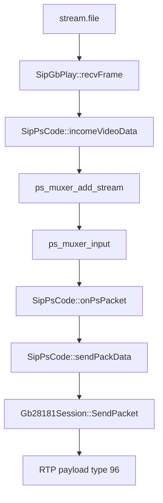
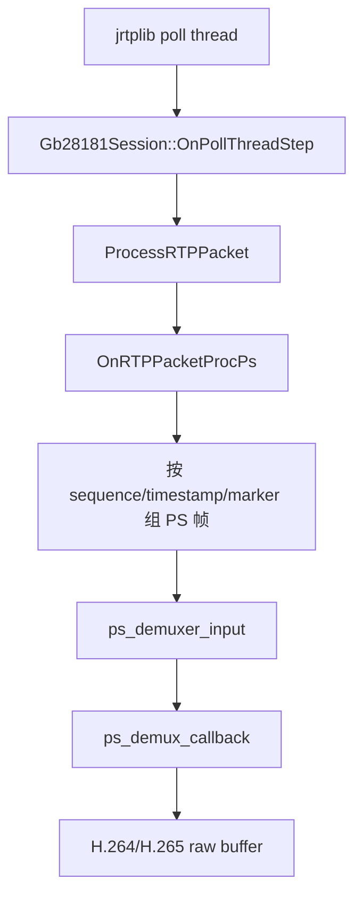

# 媒体流程现状

更新日期：2026-06-29

## 总体链路

```text
SipSubService/conf/stream.file
  -> H.264 frame + StreamHeader
  -> PS mux
  -> RTP payload type 96
  -> SipSupService RTP receive
  -> PS demux
  -> H.264/H.265 raw stream
```

## 下级发流



代码入口：

- 读取本地帧：[SipSubService/src/SipGbPlay.cpp](../SipSubService/src/SipGbPlay.cpp)
- PS mux 初始化：[SipSubService/src/Gb28181Session.cpp](../SipSubService/src/Gb28181Session.cpp)
- 视频输入 PS mux：[SipSubService/src/Gb28181Session.cpp](../SipSubService/src/Gb28181Session.cpp)
- RTP 分片发送：[SipSubService/src/Gb28181Session.cpp](../SipSubService/src/Gb28181Session.cpp)

现状说明：

- 下级从 `../conf/stream.file` 读取测试帧。
- 帧头使用 `StreamHeader`，定义在 [SipSubService/include/Common.h](../SipSubService/include/Common.h)。
- 视频帧进入 `ps_muxer_input()`，PTS/DTS 使用毫秒转 90k 时钟。
- PS 包按约 1300 字节拆成 RTP 包。
- 最后一个分片 marker 置位。

## 上级收流



代码入口：

- RTP poll 回调：[SipSupService/src/Gb28181Session.cpp](../SipSupService/src/Gb28181Session.cpp)
- RTP 包解析：[SipSupService/src/Gb28181Session.cpp](../SipSupService/src/Gb28181Session.cpp)
- RTP/PS 组包：[SipSupService/src/Gb28181Session.cpp](../SipSupService/src/Gb28181Session.cpp)
- PS demux：[SipSupService/src/Gb28181Session.cpp](../SipSupService/src/Gb28181Session.cpp)
- 裸流回调：[SipSupService/src/Gb28181Session.cpp](../SipSupService/src/Gb28181Session.cpp)

现状说明：

- 当前只处理 payload type `96` 的 PS；payload type `98` 的 H.264 直传分支还未实现。
- 接收侧根据 sequence 判断丢包。
- 根据 marker 和 timestamp 判断帧边界。
- 丢包后会丢弃当前残帧，等待下一帧起始点恢复。
- PS demux 未消费完的数据会保留到下一次输入；解析错误时会重置 demuxer。

## RTP/RTCP

当前使用 jrtplib：

- 下级发送侧创建 RTP session 后 `SendPacket()`。
- 上级接收侧创建 RTP session 后由 poll thread 调用 `OnPollThreadStep()`。
- RTP timestamp 使用 90k 时钟。
- 下级会检查 RTCP RR 超时，作为推流是否存活的判断之一。

代码入口：

- 下级 RTP session：[SipSubService/src/Gb28181Session.cpp](../SipSubService/src/Gb28181Session.cpp)
- 下级 RTCP RR 检查：[SipSubService/include/Gb28181Session.h](../SipSubService/include/Gb28181Session.h)
- 上级 RTP session：[SipSupService/src/Gb28181Session.cpp](../SipSupService/src/Gb28181Session.cpp)

## 文件与调试输出

输入：

- `SipSubService/conf/stream.file`：带 `StreamHeader` 的测试媒体流。
- `SipSubService/conf/catalog.json`：目录响应测试数据。

调试输出：

- `SipSubService/conf/out.h264`：下级读取后写出的调试裸流。
- `SipSupService/conf/send.h264`：上级 PS demux 后写出的调试裸流。

验证命令：

```bash
ffplay -f h264 SipSupService/conf/send.h264
ffplay -f h264 SipSubService/conf/out.h264
```

## 当前风险

- `stream.file` 是自定义帧文件，不是标准裸 H.264 文件。
- 上级输出裸流文件目前属于调试逻辑，缺少可配置路径和生命周期控制。
- 目录文件读取存在绝对路径硬编码。
- PS demux 回调里已经开始区分 H.264/H.265/AAC/G.711，但后续转封装还需要稳定时间戳、关键帧和 extradata。
- TCP/RTP 主被动连接有代码基础，但阶段 0 应优先验证 UDP 链路。

## 阶段 0 媒体验收清单

- 下级能读取 `stream.file`。
- 下级能把 H.264 输入 PS mux。
- 下级能把 PS 拆成 RTP payload type `96` 发送。
- 上级能收到 RTP 并检测 sequence、timestamp、marker。
- 上级能 PS demux 并输出 H.264 裸流。
- `ffplay -f h264` 能播放输出文件。
