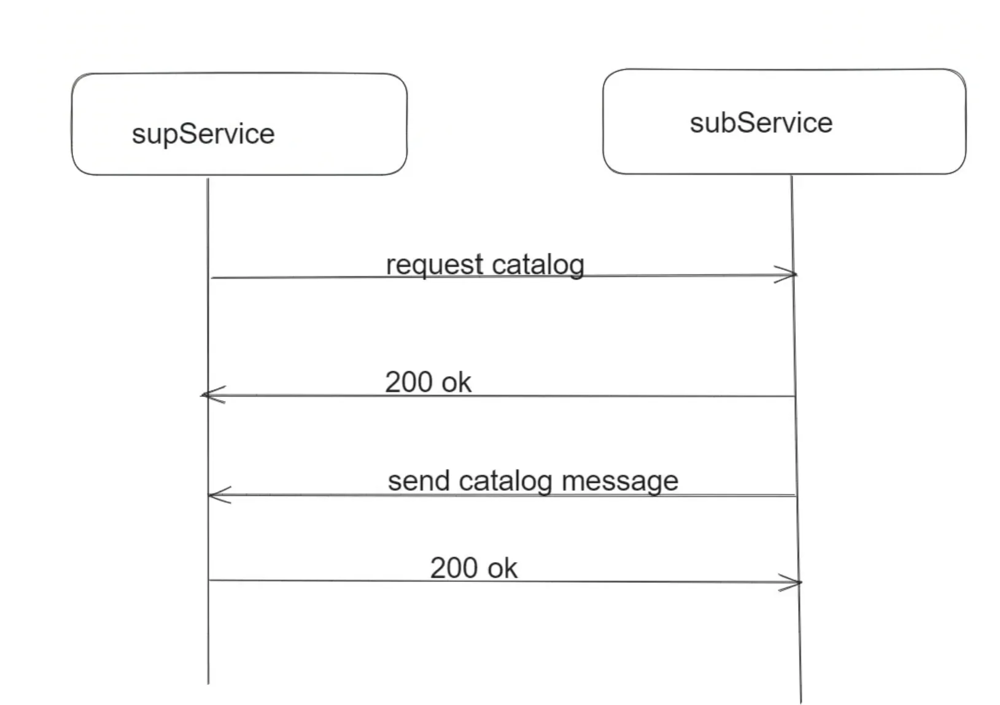

# GB28181 目录（Catalog）代码梳理笔记

本文把当前工程里“上级发目录查询、下级回目录响应、上级接收目录响应”的代码链路整理成一份可回看笔记。

---

## 1. 先看整体交互



本工程里的目录交互，实际代码链路可以概括成：

1. 上级 `SipSupService` 启动后，主动遍历已注册下级。
2. 对每个下级发送一次 SIP `MESSAGE`，body 为 GB28181 `Catalog` 查询 XML。
3. 下级 `SipSubService` 收到后，先返回 SIP 层 `200 OK`。
4. 下级再读取本地目录文件，组装 `<Response><CmdType>Catalog</CmdType>...</Response>`。
5. 下级按“每次 1 个 item”的方式分包发送给上级。
6. 上级收到目录响应后解析 XML，但当前版本主要完成了解析框架，真正落库存储/挂接设备列表的逻辑还比较弱。


---

## 2. 代码地图

### 2.1 上级侧（SipSupService）

- 启动后触发目录查询： [SipSupService/src/main.cpp](../../../SipSupService/src/main.cpp#L106-L108)
- 目录查询类声明： [SipSupService/include/GetCatalog.h](../../../SipSupService/include/GetCatalog.h)
- 目录查询发送实现： [SipSupService/src/GetCatalog.cpp](../../../SipSupService/src/GetCatalog.cpp)
- 上级接收目录响应的分发入口： [SipSupService/src/SipCore.cpp](../../../SipSupService/src/SipCore.cpp#L24-L82)
- 上级解析目录响应： [SipSupService/src/SipDirectory.cpp](../../../SipSupService/src/SipDirectory.cpp)

### 2.2 下级侧（SipSubService）

- 下级接收目录查询的分发入口： [SipSubService/src/SipCore.cpp](../../../SipSubService/src/SipCore.cpp#L22-L49)
- 下级目录处理类声明： [SipSubService/include/SipDirectory.h](../../../SipSubService/include/SipDirectory.h)
- 下级目录查询响应实现： [SipSubService/src/SipDirectory.cpp](../../../SipSubService/src/SipDirectory.cpp)

---

## 4. 上级如何发起目录查询

### 4.2 发送入口
发送逻辑在：

- [SipSupService/src/GetCatalog.cpp](../../../SipSupService/src/GetCatalog.cpp#L15-L61)

核心流程：

1. 加锁访问 `GlobalCtl::getSubDomainInfoList()`。
2. 遍历每个下级。
3. 仅对 `iter->registered == true` 的下级发送查询。
4. 构造 SIP `MESSAGE` 请求。
5. 构造 XML：`<Query><CmdType>Catalog</CmdType><SN>...</SN><DeviceID>...</DeviceID></Query>`。
6. 设置 `Content-Type: Application/MANSCDP+xml`。
7. 调用 `pjsip_endpt_send_request(...)` 发出。

### 4.3 查询 XML 结构

工程里的查询 body 是：

```xml
<?xml version="1.0"?>
<Query>
	<CmdType>Catalog</CmdType>
	<SN>123</SN>
	<DeviceID>下级sipId</DeviceID>
</Query>
```

字段含义：

- `CmdType=Catalog`：目录查询。
- `SN`：流水号，当前代码为 `random()%1024`。
- `DeviceID`：填下级平台或设备的 `sipId`。

### 4.4 SIP 构造细节

上级发送时使用：

- `setFrom()`：本机 `sipId + sipIp`
- `setTo()`：下级 `sipId + addrIp`
- `setUrl()`：下级 `sipId + addrIp + sipPort`
- `Method`：`MESSAGE`

所以这部分本质是“手工组包一个 `MESSAGE` 请求，再把 GB28181 XML 挂到 body 上”。

---

## 5. 下级如何接收目录查询

### 5.1 分发入口

下级接收入口在：

- [SipSubService/src/SipCore.cpp](../../../SipSubService/src/SipCore.cpp#L22-L49)

当前逻辑是：

1. 收到 `PJSIP_OTHER_METHOD`。
2. 调 `SipTaskBase::parseXmlData(...)` 解析 XML 根节点和 `CmdType`。
3. 若 `rootType == Query` 且 `cmdValue == Catalog`，则创建下级目录任务对象 `SipDirectory`。

也就是说，下级对于目录查询的识别条件是：

```text
Method = OTHER_METHOD
rootType = Query
CmdType = Catalog
```

### 5.2 执行入口

实际处理函数是：

- [SipSubService/src/SipDirectory.cpp](../../../SipSubService/src/SipDirectory.cpp#L14-L35)

`SipDirectory::run()` 做了三件事：

1. `resDir(...)`：校验查询 XML，并给本次查询先回复 SIP `200`。
2. `directoryQuery(...)`：从本地 JSON 读出目录数据。
3. `constructMANSCDPXml(...) + sendSipDirMsg(...)`：组装目录响应并分包发给上级。

---

## 6. 下级如何回目录响应

### 6.1 先回 200 OK

处理查询参数和响应 `200` 的函数在：

- [SipSubService/src/SipDirectory.cpp](../../../SipSubService/src/SipDirectory.cpp#L178-L223)

它当前做的检查包括：

1. 解析请求 body XML。
2. 取出 `DeviceID`。
3. 校验 `DeviceID` 是否等于本机 `GBOJ(gConfig)->sipId()`。
4. 取出 `SN` 并传回调用方。
5. 通过 `pjsip_endpt_respond(...)` 回复状态码，成功时通常为 `200`。

这里的 `SN` 会原样带回目录响应里，便于上级把“响应”与“查询”对应起来。

### 6.2 目录数据来源

目录数据不是实时从设备树动态拼的，而是直接从本地 JSON 文件读：

- [SipSubService/src/SipDirectory.cpp](../../../SipSubService/src/SipDirectory.cpp#L225-L236)

文件路径写死为：

```text
/home/media-fabric/SipSubService/conf/catalog.json
```

读出后调用 `JsonParse(payload).toJson(jsonOut)` 转成 `Json::Value`。

### 6.3 目录响应 XML 如何生成

XML 构造在：

- [SipSubService/src/SipDirectory.cpp](../../../SipSubService/src/SipDirectory.cpp#L38-L124)

生成的根节点是 `Response`，主体结构如下：

```xml
<?xml version="1.0"?>
<Response>
	<CmdType>Catalog</CmdType>
	<SN>查询时带来的SN</SN>
	<DeviceID>本级sipId</DeviceID>
	<SumNum>总条数</SumNum>
	<DeviceList Num="本次返回条数">
		<item>
			<DeviceID>...</DeviceID>
			<Name>...</Name>
			<Manufacturer>...</Manufacturer>
			<Model>...</Model>
			<Owner>unknow</Owner>
			<CivilCode>...</CivilCode>
			<Parental>...</Parental>
			<ParentID>...</ParentID>
			<SafetyWay>...</SafetyWay>
			<RegisterWay>...</RegisterWay>
			<Secrecy>...</Secrecy>
			<Status>...</Status>
		</item>
	</DeviceList>
</Response>
```

### 6.4 为什么每次只发 1 个 item

`run()` 里有这段逻辑：

```cpp
int sendCnt=1;
while(begin<sum)
{
	constructMANSCDPXml(..., sendCnt, ...);
	sendSipDirMsg(...);
	usleep(15*1000);
}
```

这是一个很明确的工程化取舍：

- 目录项一多，XML 体积会变大。
- 如果用 UDP 发送，超过 MTU 后可能分片。
- 分片丢失会导致 XML 不完整、对端解析失败。

因此当前实现选择：**每次只塞 1 个目录项，宁可多发几包，也尽量避免 UDP 分片。**

### 6.5 下级是怎么发给上级的

发送函数在：

- [SipSubService/src/SipDirectory.cpp](../../../SipSubService/src/SipDirectory.cpp#L126-L176)

这段代码会：

1. 通过 `parseFromId(msg)` 从原始查询里解析上级 `fromId`。
2. 在 `GlobalCtl::getSupDomainInfoList()` 中查找对应上级。
3. 重新组 SIP 请求头。
4. 使用 `NOTIFY` 作为方法。
5. 把 XML body 以 `Application/MANSCDP+xml` 发出。

所以本项目下级目录响应的发送方式，不是“复用原事务回复 body”，而是：

```text
先回 200 OK
再新发一个 NOTIFY，请求体里带 Catalog Response XML
```

---

## 7. 上级如何接收目录响应

### 7.1 上级分发入口

入口在：

- [SipSupService/src/SipCore.cpp](../../../SipSupService/src/SipCore.cpp#L24-L82)

识别逻辑是：

1. 收到 `PJSIP_OTHER_METHOD`。
2. 通过 `SipTaskBase::parseXmlData(...)` 得到：
   - `rootType`
   - `cmdValue`
3. 如果 `rootType == Response && cmdValue == Catalog`，则进入上级目录处理类 `SipDirectory(root)`。

```text
rootType = Response
CmdType = Catalog
```

### 7.2 上级目录响应解析逻辑

解析实现位于：

- [SipSupService/src/SipDirectory.cpp](../../../SipSupService/src/SipDirectory.cpp#L14-L124)

当前 `run()` 流程：

1. `SaveDir(status_code)` 解析目录 XML。
2. 然后调用 `pjsip_endpt_respond(...)` 给收到的这条请求回一个 SIP 响应。

`SaveDir(...)` 当前已经做了：

- 校验根节点存在。
- 读取 `DeviceID`、`SumNum`、`SN`。
- 校验中心 `DeviceID` 是否有效。
- 遍历 `DeviceList/item`。
- 读取 `Manufacturer`、`Model`、`Owner`、`CivilCode`、`Parental`、`SafetyWay`、`RegisterWay`、`Secrecy`、`Status`。

---


## 10. 目录请求与响应的关键 XML 速记

### 10.1 上级发出的查询

```xml
<Query>
	<CmdType>Catalog</CmdType>
	<SN>123</SN>
	<DeviceID>下级ID</DeviceID>
</Query>
```

### 10.2 下级发回的响应

```xml
<Response>
	<CmdType>Catalog</CmdType>
	<SN>123</SN>
	<DeviceID>本级ID</DeviceID>
	<SumNum>4</SumNum>
	<DeviceList Num="1">
		<item>
			<DeviceID>...</DeviceID>
			<Name>...</Name>
			<Manufacturer>...</Manufacturer>
			<Model>...</Model>
			<Owner>...</Owner>
			<CivilCode>...</CivilCode>
			<Parental>...</Parental>
			<ParentID>...</ParentID>
			<SafetyWay>...</SafetyWay>
			<RegisterWay>...</RegisterWay>
			<Secrecy>...</Secrecy>
			<Status>ON</Status>
		</item>
	</DeviceList>
</Response>
```
