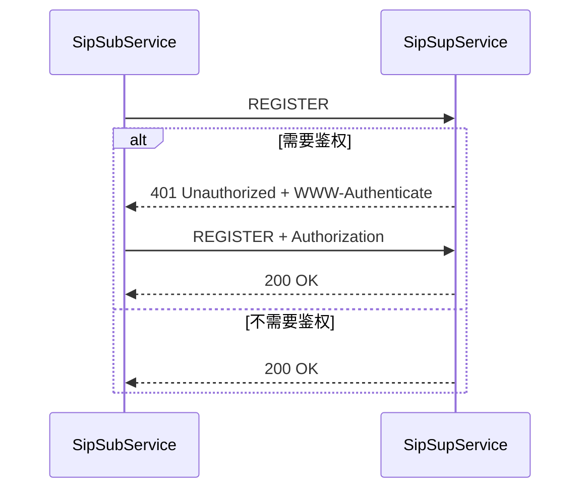
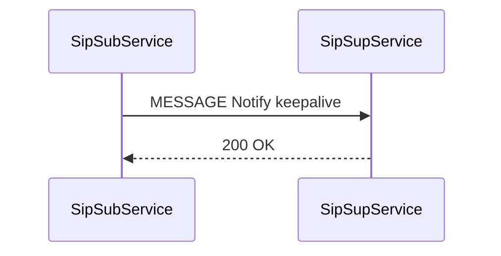
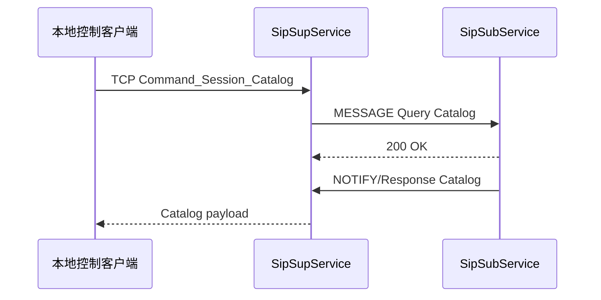
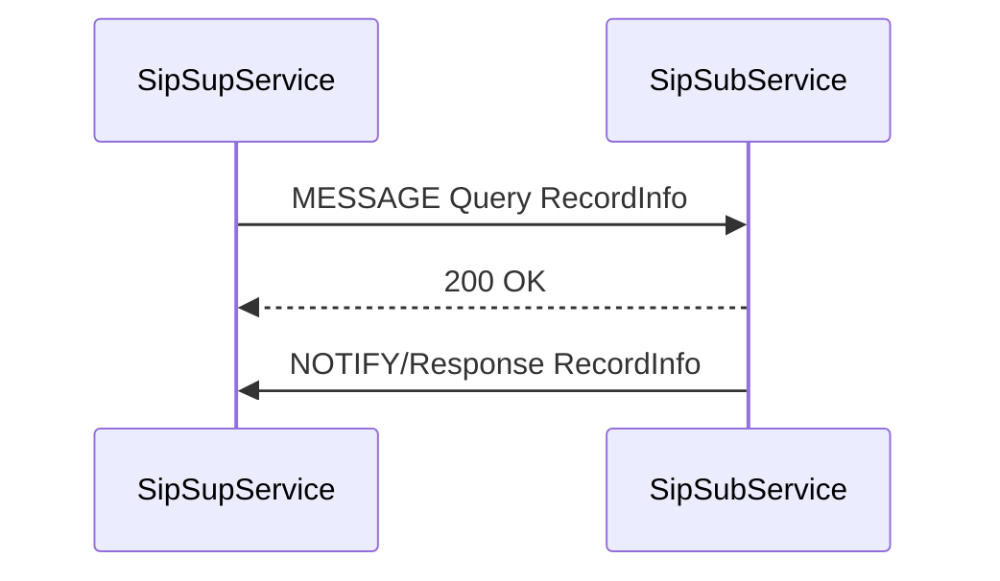
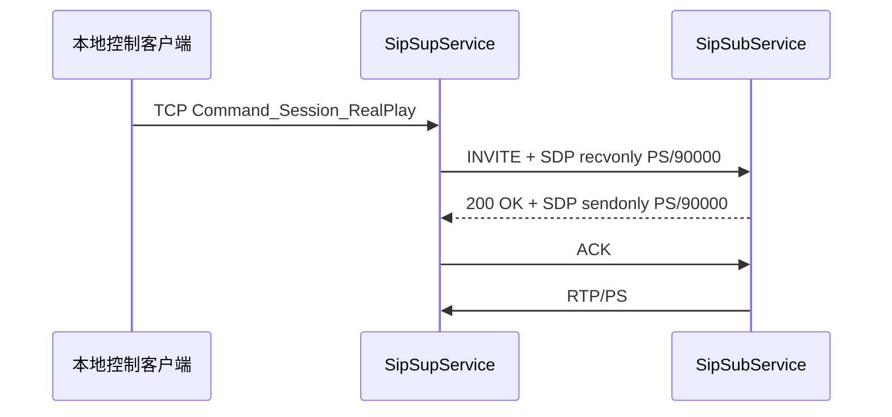
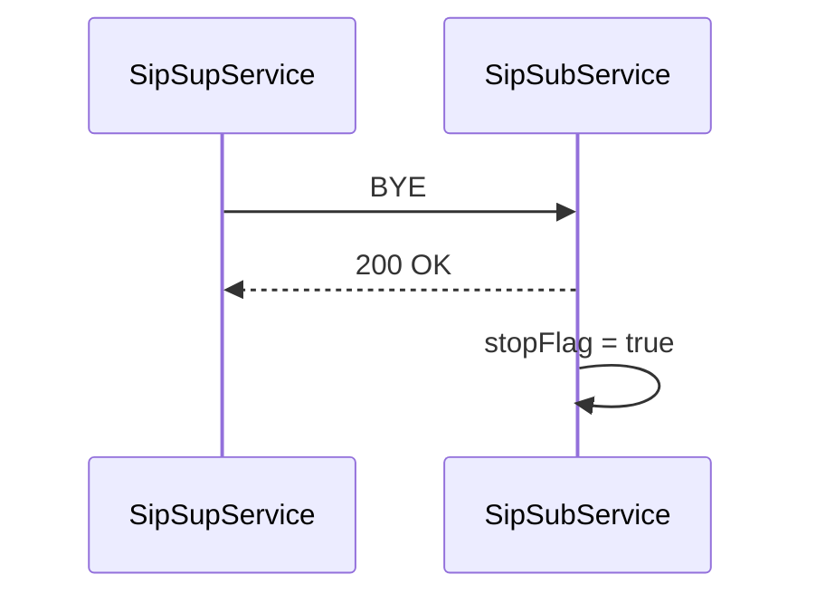

# 信令流程现状

更新日期：2026-06-29

## SIP 消息分发

上级平台消息分发入口：[SipSupService/src/SipCore.cpp](../SipSupService/src/SipCore.cpp)

- `REGISTER` 分发到 `SipRegister`。
- `MESSAGE` 中 `Notify/keepalive` 分发到 `SipHeartBeat`。
- `MESSAGE` 中 `Response/Catalog` 分发到 `SipDirectory`。
- `MESSAGE` 中 `Response/RecordInfo` 分发到 `SipRecordList`。

下级平台消息分发入口：[SipSubService/src/SipCore.cpp](../SipSubService/src/SipCore.cpp)

- `MESSAGE` 中 `Query/Catalog` 分发到 `SipDirectory`。
- `MESSAGE` 中 `Query/RecordInfo` 分发到 `SipRecordList`。
- `INVITE` 和 `BYE` 分发到 `SipGbPlay`。

## REGISTER

代码入口：

- 下级定时注册启动：[SipSubService/src/SipRegister.cpp](../SipSubService/src/SipRegister.cpp)
- 下级构造 REGISTER：[SipSubService/src/SipRegister.cpp](../SipSubService/src/SipRegister.cpp)
- 上级 REGISTER 分发：[SipSupService/src/SipCore.cpp](../SipSupService/src/SipCore.cpp)
- 上级注册处理：[SipSupService/src/SipRegister.cpp](../SipSupService/src/SipRegister.cpp)

现状说明：

- 下级通过 `TaskTimer` 周期性检查未注册上级节点，并调用 `gbRegister()`。
- 上级根据配置决定是否鉴权。
- 注册成功后，上级记录下级 `registered`、`expires`、`lastRegTime`。

## MESSAGE Keepalive

代码入口：

- 下级心跳定时器：[SipSubService/src/SipHeartBeat.cpp](../SipSubService/src/SipHeartBeat.cpp)
- 下级构造 keepalive XML：[SipSubService/src/SipHeartBeat.cpp](../SipSubService/src/SipHeartBeat.cpp)
- 上级心跳分发：[SipSupService/src/SipCore.cpp](../SipSupService/src/SipCore.cpp)
- 上级心跳处理：[SipSupService/src/SipHeartBeat.cpp](../SipSupService/src/SipHeartBeat.cpp)

现状说明：

- 下级只对已注册上级发送心跳。
- 上级收到心跳后更新下级 `lastRegTime`。
- 上级注册检查定时器会根据 `expires` 判断注册是否过期。

## Catalog

代码入口：

- 本地 TCP 命令解析：[SipSupService/src/EventMsgHandle.cpp](../SipSupService/src/EventMsgHandle.cpp)
- 上级目录请求：[SipSupService/src/GetCatalog.cpp](../SipSupService/src/GetCatalog.cpp)
- 下级目录查询处理：[SipSubService/src/SipDirectory.cpp](../SipSubService/src/SipDirectory.cpp)
- 上级目录响应解析：[SipSupService/src/SipDirectory.cpp](../SipSupService/src/SipDirectory.cpp)

现状说明：

- 上级通过本地 TCP 命令触发目录查询。
- 下级从 `catalog.json` 读取目录数据并按条构造 MANSCDP XML。
- 当前 `catalog.json` 读取路径存在绝对路径硬编码，后续需要配置化。

## RecordInfo

代码入口：

- 上级录像查询任务：[SipSupService/src/GetRecordList.cpp](../SipSupService/src/GetRecordList.cpp)
- 下级录像查询响应：[SipSubService/src/SipRecordList.cpp](../SipSubService/src/SipRecordList.cpp)
- 上级录像响应解析：[SipSupService/src/SipRecordList.cpp](../SipSupService/src/SipRecordList.cpp)

现状说明：

- 项目已有 RecordInfo 类和分发入口。
- 阶段 0 重点先盘点流程，不扩展录像存储与回放系统。

## INVITE 实时预览

代码入口：

- 本地开流命令：[SipSupService/src/EventMsgHandle.cpp](../SipSupService/src/EventMsgHandle.cpp)
- 上级构造 INVITE/SDP：[SipSupService/src/OpenStream.cpp](../SipSupService/src/OpenStream.cpp)
- 上级收到 200 OK 后创建 RTP 会话：[SipSupService/src/SipGbPlay.cpp](../SipSupService/src/SipGbPlay.cpp)
- 下级处理 INVITE：[SipSubService/src/SipGbPlay.cpp](../SipSubService/src/SipGbPlay.cpp)
- 下级响应 SDP：[SipSubService/src/SipGbPlay.cpp](../SipSubService/src/SipGbPlay.cpp)

现状说明：

- 当前 `OpenStream` 中设备 ID、平台 ID、协议和流类型存在硬编码。
- SDP 使用 payload type `96`，`rtpmap:96 PS/90000`。
- UDP 是当前默认路径，TCP 主被动连接逻辑已有基础实现。

## BYE

代码入口：

- 上级发送 BYE：[SipSupService/src/OpenStream.cpp](../SipSupService/src/OpenStream.cpp)
- 下级处理 BYE：[SipSubService/src/SipGbPlay.cpp](../SipSubService/src/SipGbPlay.cpp)

现状说明：

- 下级收到 BYE 后会标记对应 `SipPsCode` 停止推流，并从流表中移除。

## 阶段 0 信令验收清单

- REGISTER 能完成 401/200 或直接 200。
- Keepalive MESSAGE 能周期发送并被上级更新状态。
- Catalog 能由本地 TCP 命令触发，并看到 Query/Response。
- INVITE 能生成 SDP，并协商出 RTP 端口。
- BYE 能停止当前流。
